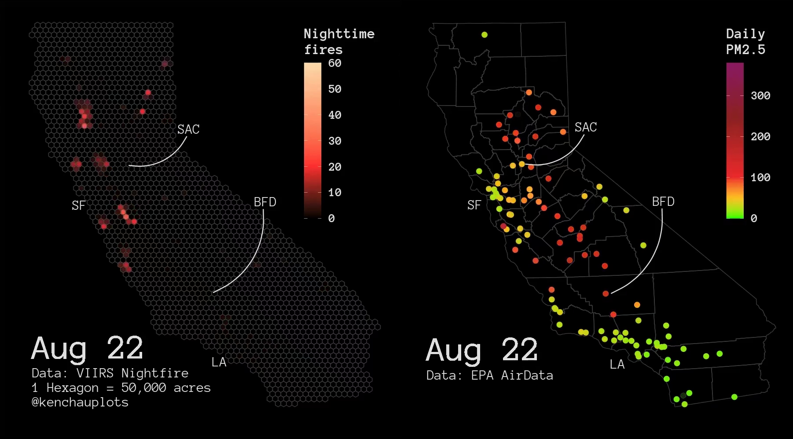

# Whims
where ken does stuff for fun

## Nighttime fires vs. PM2.5
Visualizing nighttime fires detected by VIIRS Nightfire algorithm along side daily PM2.5 means from EPA AirData, from August 1st through September 10th. Check out the [video](https://streamable.com/j5xolx).

